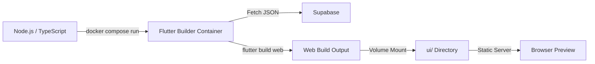

## 1. Introduction

This project is a **Dockerized Flutter Web Preview Builder** that dynamically generates Flutter projects from Supabase-stored JSON and builds them as web apps.
It is designed for **AI-generated Flutter code previews**, similar to Lovable/Replit, but focused on Flutter.
The system runs builds in an isolated Docker container and exposes the final web output via a shared `ui/` directory.

---

## 2. Architecture



**Explanation:**

* A Node.js service triggers the build using Docker Compose.
* The Flutter builder container fetches project files from Supabase.
* Flutter Web is built inside the container.
* The final static build is copied into the shared `ui/` directory.
* The UI can be previewed using a simple static server.

---

## 3. How It Works

* `index.ts` triggers the build with a project ID and project name.
* `buildProject.ts` runs `docker compose run` with environment variables.
* Docker spins up a Flutter builder container.
* The container:

  * Creates a Flutter project
  * Fetches project JSON from Supabase
  * Writes files into the Flutter project
  * Runs `flutter pub get`
  * Builds the Flutter Web app
* The compiled web output is copied to the shared `ui/` folder.
* The container exits after a successful build.

---

## 4. How to Use the `ui/` Directory (Preview the App)

After the build completes, the Flutter Web output will be available in the `ui/` directory.

```bash
cd ui
python -m http.server 8000
```

* Open your browser and go to:
  **[http://localhost:8000](http://localhost:8000)**
* The Flutter web app will be served as a static site on port **8000**.

---

### Optional Notes

* Ensure `.env` is properly configured with Supabase credentials.
* Docker and Flutter do **not** need to be installed locally — everything runs inside the container.
* Each build is isolated and reproducible.

